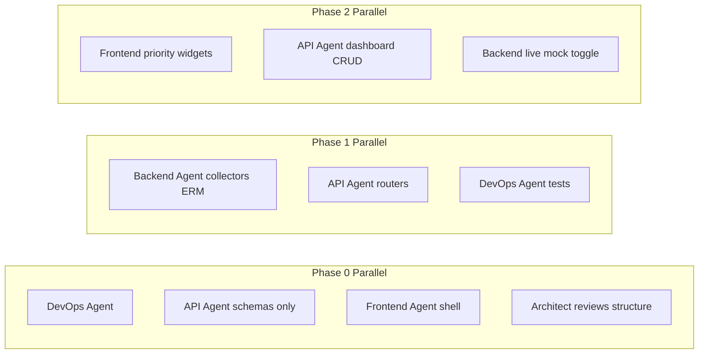

# Agent Roles (Final)

### 2.1 Agent Roster (5 core + 1 optional)

| # | Role | Grok Skill Name | Writes Code? |
|---|------|-----------------|--------------|
| 1 | Lead Architect Agent | `architect` | Review only (integration exceptions) |
| 2 | Backend and Data Collection Agent | `backend-collector` | Yes |
| 3 | Frontend and Widget System Agent | `frontend-widgets` | Yes |
| 4 | API, Models and LLM Extensibility Agent | `api-llm` | Yes |
| 5 | DevOps, Testing and Deployment Agent | `devops-deploy` | Yes |
| 6 | Security and Quality Reviewer (optional) | `security-review` | Review only |

### 2.2 Refinements Over initial_agents.md

**Lead Architect Agent** — add explicit artifacts:
- Maintains [`docs/CONTRACTS.md`](/home/krich/src/dashboard/docs/CONTRACTS.md) (single source for data shapes)
- Signs off each phase with a checklist (not just "complete")
- Blocks phase advance if priority widgets or JSON serializability regresses

**Backend Agent** — add sequencing rule:
- Implement `MockConnector` + `ExternalReachabilityMonitor` before any vendor connector
- Publish sample fixture files in `mocks/` that API and Frontend can consume immediately

**Frontend Agent** — add contract rule:
- Never invent API shapes; import from `frontend/src/types/` generated or hand-synced from Pydantic schemas
- Widget folder convention: `WidgetName/index.tsx`, `config.schema.ts`, `config.form.tsx`, `defaults.json`

**API Agent** — add deliverable:
- Owns `schemas/json/` directory with exported JSON Schema files per widget type and dashboard layout
- Publishes example payloads: `examples/dashboard-default.json`, `examples/widget-updown.json`

**DevOps Agent** — add tooling:
- pytest + vitest from day one
- `make test`, `make dev`, `make build` targets
- Pre-commit: ruff, mypy (backend), eslint (frontend)

**Security Reviewer** — invoke at end of Phases 1, 2, and 4 (not every commit)

### 2.3 Parallel Spawn Matrix

| Phase | Spawn Together | Sequential First |
|-------|---------------|------------------|
| 0 | DevOps + API (schemas) + Frontend (shell) | Architect approves folder structure before code |
| 1 | Backend + API + DevOps | API publishes contracts (day 1); Backend implements to contract |
| 2 | Frontend (widgets) + API (dashboard CRUD) | Backend confirms endpoints live; Frontend uses mocks if not |
| 3 | Frontend (composer) + API (import/export) | Frontend leads; API supports |
| 4 | DevOps + Security Reviewer | Architect final sign-off |

### 2.4 Handoff and Communication Rules

**Rule 1 — Contracts before implementation**
- API Agent publishes Pydantic models + OpenAPI stub before Backend/Frontend implement against them
- Changes to contracts require Architect approval + update to `docs/CONTRACTS.md`

**Rule 2 — Widget config alignment**
- Backend: Pydantic `WidgetInstanceConfig` per type in `schemas/widgets/`
- Frontend: matching Zod schema in `components/widgets/<Type>/config.schema.ts`
- API Agent provides `scripts/validate_widget_config.py` test

**Rule 3 — Mock data sharing**
- Backend owns `mocks/` generation script
- Frontend and API consume same fixtures; no duplicate fake data

**Rule 4 — Status updates**
- Each agent ends work sessions with: files changed, tests run, blockers, "ready for X review"
- Architect synthesizes into phase status

**Rule 5 — Git discipline**
- One logical commit per component (e.g., `feat(collector): add ExternalReachabilityMonitor`)
- Phase boundary = tagged commit (`phase-0-complete`, etc.)

### 2.5 When to Invoke Lead Architect

| Trigger | Action |
|---------|--------|
| Phase start | Approve task breakdown and agent assignments |
| Contract change | Review data shape impact on widgets + API |
| Phase checkpoint | Run checklist; approve or send back |
| Priority widget complete | Verify UpDown/Internet bind correctly to aggregation |
| Scope creep detected | Any agent flags "out of spec" item |
| Phase 4 complete | Final architecture + LLM extensibility sign-off |

### 2.6 Architect Phase Checklists (abbreviated)

**Phase 1 gate**: ERM stores results; `/status/high-level` returns correct banner for mock scenarios; creds encrypted; tests pass
**Phase 2 gate**: Both priority widgets render on overview page with real API data; inventory page loads 67 mock devices
**Phase 3 gate**: Dashboard JSON round-trip (export → edit → import) with zero loss; 5 widgets in registry
**Phase 4 gate**: systemd starts service; README deploy section verified; JSON schemas published

---
