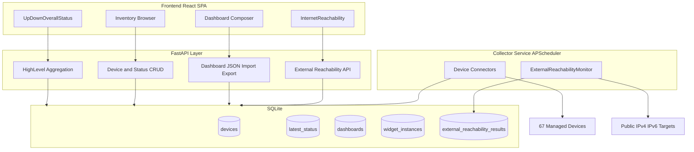

# Project Specification (Final v1.2)

### Datacenter Status Dashboard — Final Spec v1.2

**Version**: 1.2 (build-ready refinement of v1.1)
**Date**: 2026-06-07
**Builder**: Grok Build multi-agent system
**Scale**: ~67 devices (7 HPE ESXi via iLO Redfish, 10 Juniper, 20 Aruba, 30 Linux)

#### 1.1 Mission

Deliver a native-Linux datacenter status dashboard with:
1. A **high-level operational view** driven by two priority widgets: **UpDownOverallStatus** and **InternetReachability**
2. Full searchable inventory of all devices
3. A modular, JSON-serializable widget/dashboard system designed for future LLM-driven customization

#### 1.2 v1 Success Criteria

| Criterion | Definition of Done |
|-----------|-------------------|
| High-level status | Banner states ("All Clear", "N Devices Down", "Internet Degraded") driven by important-device rollup + internet health |
| Priority widgets | UpDownOverallStatus and InternetReachability fully functional, configurable, and on default dashboard |
| ExternalReachabilityMonitor | Independent background task polling IPv4/IPv6 targets; results in DB + API |
| Inventory | All ~67 devices visible, searchable, filterable, with detail view |
| Widget system | Registry-based widgets with JSON config schemas; at least 5 widget types registered |
| Dashboard composer | Drag/resize, edit mode, save/load JSON layouts |
| Mocks-first | Entire system runnable with zero real devices via `MOCK_MODE=true` |
| Native deploy | `requirements.txt` + venv + systemd unit; no Docker |
| LLM-ready | Dashboard import/export endpoints + documented JSON schemas |

**Non-goals (v1)**: Long-term metrics/trends (stub only), alerting, write actions, auto-discovery, multi-user RBAC.

#### 1.3 Architecture



#### 1.4 Normalized Data Contracts (authoritative shapes)

**DeviceStatus** (per device, stored in `latest_status`):
```json
{
  "device_id": "uuid",
  "overall": "ok|warning|critical|unknown|down",
  "message": "string",
  "metrics": { "cpu_pct": 42, "mem_pct": 61, "temp_c": 38, "power_state": "on" },
  "details": {},
  "timestamp": "ISO-8601"
}
```

**ExternalReachabilityResult**:
```json
{
  "ipv4_ok": true,
  "ipv6_ok": false,
  "ipv4_targets": [{ "target": "1.1.1.1", "ok": true, "latency_ms": 12, "error": null }],
  "ipv6_targets": [{ "target": "2606:4700::", "ok": false, "latency_ms": null, "error": "timeout" }],
  "overall": "degraded",
  "timestamp": "ISO-8601"
}
```

**HighLevelSummary** (feeds UpDownOverallStatus):
```json
{
  "banner": "all_clear|devices_down|internet_degraded|mixed",
  "banner_text": "All Systems Operational",
  "important_total": 12,
  "important_up": 12,
  "important_down": 0,
  "internet_health": "ok|degraded|down",
  "internet_summary": "IPv4 OK, IPv6 Degraded",
  "worst_overall": "ok",
  "timestamp": "ISO-8601"
}
```

**High-level rollup rules**:
- Important devices = `important_flag=true`
- Device "up" = successful poll within staleness window AND `overall` not in `{critical, unknown, down}`
- Internet health = combine v4/v6 per config flag `require_both_families` (default: both required for "ok")
- Banner = worst of (important-device health, internet health)

#### 1.5 Early Deliverables (non-negotiable ordering)

1. **Mock data layer** — fake 67 devices + reachability results (Phase 0)
2. **ExternalReachabilityMonitor** — independent collector, config-driven, stores results (Phase 1, week 1)
3. **High-level aggregation API** — `/api/v1/status/high-level` (Phase 1)
4. **UpDownOverallStatus widget** — big visual, binds to high-level API (Phase 2, first widget)
5. **InternetReachability widget** — IPv4/IPv6 status, per-target detail (Phase 2, second widget)

#### 1.6 Widget Registry (v1)

| Widget Type | Priority | Data Source |
|-------------|----------|-------------|
| `UpDownOverallStatus` | P0 | `/api/v1/status/high-level` |
| `InternetReachability` | P0 | `/api/v1/reachability/latest` |
| `ImportantDevicesStatusGrid` | P1 | `/api/v1/devices?important=true` |
| `IssuesList` | P1 | `/api/v1/status/issues` |
| `InventoryTable` | P1 | `/api/v1/devices` |

Each widget: TSX component + Zod config schema + `description_for_llm` string + default config JSON.

#### 1.7 Tech Stack (locked)

- **Backend**: Python 3.12+, FastAPI, Pydantic v2, SQLAlchemy 2.0, SQLite, APScheduler, httpx, icmplib, cryptography (Fernet), vendor libs per connector
- **Frontend**: React 18, TypeScript, Vite, Tailwind, shadcn/ui, lucide-react, react-grid-layout, zod, TanStack Query
- **Deploy**: uvicorn + FastAPI StaticFiles (single port) or optional nginx; systemd unit
- **Packaging**: [`requirements.txt`](/home/krich/src/dashboard/requirements.txt) (backend), `package.json` (frontend)

#### 1.8 Folder Structure (target)

```
dashboard/
├── backend/
│   ├── app/
│   │   ├── main.py
│   │   ├── config.py
│   │   ├── db/              # session, base
│   │   ├── models/          # SQLAlchemy ORM
│   │   ├── schemas/         # Pydantic request/response + JSON schemas
│   │   ├── routers/         # devices, status, dashboards, reachability, health
│   │   ├── services/        # aggregation, collector orchestration
│   │   └── collectors/
│   │       ├── base.py
│   │       ├── mock.py
│   │       ├── hpe_ilorest.py
│   │       ├── juniper.py
│   │       ├── aruba.py
│   │       ├── linux_ssh.py
│   │       └── external_reachability.py
│   ├── tests/
│   └── requirements.txt
├── frontend/
│   └── src/
│       ├── api/             # typed fetch clients
│       ├── hooks/           # useHighLevelStatus, useReachability, etc.
│       ├── types/           # shared TS types (mirror Pydantic)
│       └── components/
│           ├── widgets/     # registry + one folder per widget
│           └── dashboard/   # composer, grid, edit mode
├── mocks/
│   ├── devices.json
│   ├── statuses.json
│   └── reachability.json
├── deploy/
│   └── datacenter-dashboard.service
├── scripts/
│   ├── dev.sh
│   └── seed_mocks.py
└── README.md
```

#### 1.9 Phased Delivery (summary)

| Phase | Focus | Exit Gate |
|-------|-------|-----------|
| 0 | Scaffolding, mocks, skeletons | `MOCK_MODE=true` boots API + frontend shell |
| 1 | Collectors, ERM, aggregation, creds | Mocks pass tests; high-level API returns data |
| 2 | Inventory UI + 2 priority widgets | Default dashboard shows live UpDown + Internet widgets |
| 3 | Full widget system + remaining widgets + JSON I/O | User can compose/save/import dashboard JSON |
| 4 | Settings, deploy, docs, LLM hooks | systemd deploy works; schemas documented |

#### 1.10 Security & Operations

- Credentials encrypted at rest (Fernet); master key via `DASHBOARD_SECRET_KEY` env var
- Collector: max 8–10 concurrent polls, 60–120s default interval, per-device backoff/circuit breaker
- External reachability: user-controlled targets only; timeouts enforced
- No secrets in logs or API responses

---
